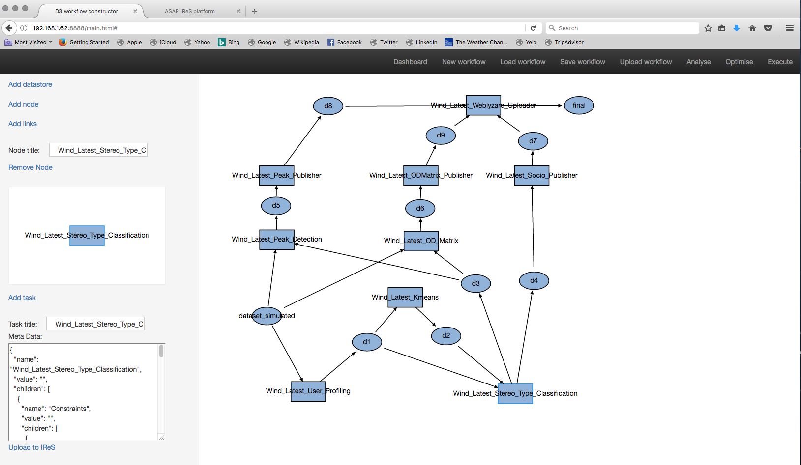
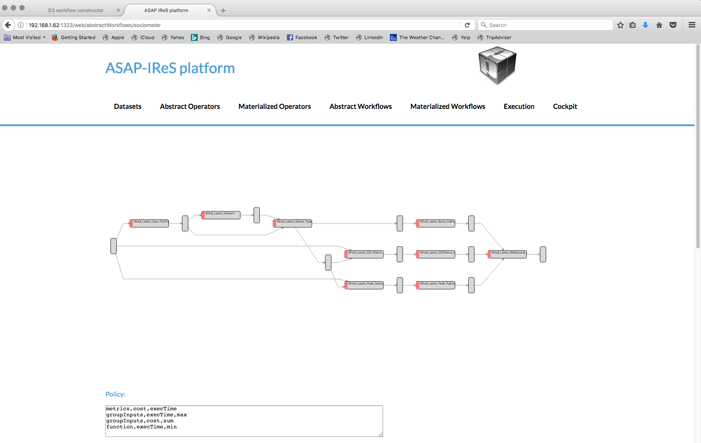
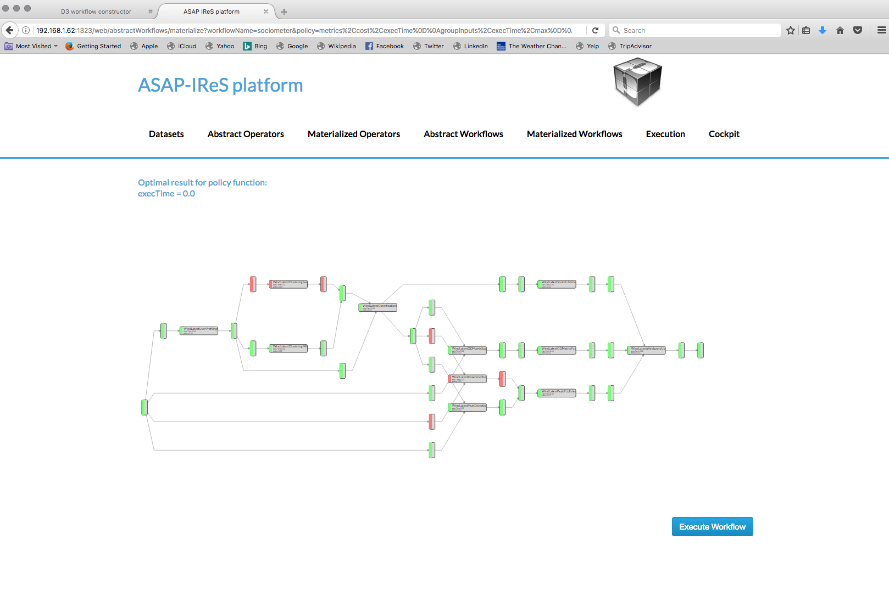
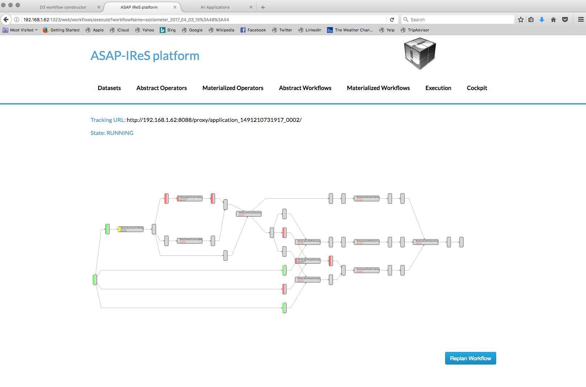

.. highlight:: rst

**********************************************************************
Guidelines for bootstraping ASAP cluster and running the WIND use case
**********************************************************************

Introduction
############

The following guide directs the users to setup an ASAP cluster and run the sociometer use case provided by the WIND.

Create VMs
##########

Prepare environment in the host machines:

* Install required packages `Centos 7 <http://linux.dell.com/files/whitepapers/KVM_Virtualization_in_RHEL_7_Made_Easy.pdf#%5B%7B%22num%22:26,%22gen%22:0%7D,%7B%22name%22:%22XYZ%22%7D,69,279,0%5D>`_, `Ubuntu <https://help.ubuntu.com/community/KVM/Installation#Install_Necessary_Packages>`_:
* Create network bridge for letting the VMs to access to the LAN `Centos 7 <chrome-extension://jdbefljfgobbmcidnmpjamcbhnbphjnb/http://linux.dell.com/files/whitepapers/KVM_Virtualization_in_RHEL_7_Made_Easy.pdf#%5B%7B%22num%22%3A33%2C%22gen%22%3A0%7D%2C%7B%22name%22%3A%22XYZ%22%7D%2C69%2C401%2C0%5D>`_, `Ubuntu <https://help.ubuntu.com/community/KVM/Networking#Creating_a_network_bridge_on_the_host>`_)
* Download asap-master image
* Create asap-master VM:

.. code:: bash

    ASAP_MASTER_IMAGE=<path to downloaded image>
    RAM=<memory in MB>
    VCORES=<number of virtual cores>
    VM=asap-master
    sudo virt-install \
    --network bridge=br0 \
    --name $VM  \
    -r $RAM \
    --vcpus $VCORES \
    --disk path=$ASAP_MASTER_IMAGE,device=disk,bus=virtio \
    --graphics vnc,listen=0.0.0.0,password=12345 \
    --connect qemu:///system \
    --virt-type kvm \
    --noautoconsole \
    --import -d

* Check VM status:

.. code:: bash

    $ sudo virsh list --all
     Id    Name                           State
    ----------------------------------------------------
    28    asap-master                    running

* Start VM (if not running already):

.. code:: bash

    $ sudo virsh start asap-master
    Domain asap-master started

* Login in asap-master using a VNC client (password *12345*) as *asap* user with password: *raiding536&ivory*
* Note the acquired IP address:

.. code:: bash

    $ ifconfig
    ens3      Link encap:Ethernet  HWaddr 52:54:00:e3:f0:24
              inet addr:192.168.1.62  Bcast:192.168.1.255  Mask:255.255.255.0
              inet6 addr: fe80::5054:ff:fee3:f024/64 Scope:Link
              UP BROADCAST RUNNING MULTICAST  MTU:1500  Metric:1
              RX packets:2039 errors:0 dropped:0 overruns:0 frame:0
              TX packets:124 errors:0 dropped:0 overruns:0 carrier:0
              collisions:527 txqueuelen:1000
              RX bytes:104691 (104.6 KB)  TX bytes:16689 (16.6 KB)

    lo        Link encap:Local Loopback
              inet addr:127.0.0.1  Mask:255.0.0.0
              inet6 addr: ::1/128 Scope:Host
              UP LOOPBACK RUNNING  MTU:65536  Metric:1
              RX packets:229 errors:0 dropped:0 overruns:0 frame:0
              TX packets:229 errors:0 dropped:0 overruns:0 carrier:0
              collisions:0 txqueuelen:1
              RX bytes:31684 (31.6 KB)  TX bytes:31684 (31.6 KB)

* Download asap-worker image
* Create several asap-worker VMs from the same image using backing files:
    * Convert the image in qcow2 format:

    .. code:: bash

        $ sudo qemu-img convert -O qcow2 <path to downloaded image> asap-worker-readonly.qcow2

    * Change ownership to readonly:

    .. code:: bash

        $ sudo chmod u-w asap-worker-readonly.qcow2

    * Create VMs:

    .. code:: bash

        $ for i in 1 2 3 4 5;
        do;
        VM=asap-worker-$i
        sudo qemu-img create -f qcow2 -b asap-worker-readonly.qcow2 $VM.qcow2
        sudo virt-install \
        --network bridge=br0 \
        --name $VM \
        --ram <memory in MB> \
        --vcores <number of cores> \
        --disk path=/tmp/$VM.qcow2,device=disk,bus=virtio \
        --graphics vnc,listen=0.0.0.0,password=12345 \
        --connect qemu:///system \
        --virt-type kvm \
        --noautoconsole \
        --import -d;
        done

    * Check VM statuses

    .. code:: bash

        $ sudo virsh list --all

    * Login in the worker VMs using a VNC client (password 12345) as *asap* user with password: *raiding536&ivory*
    * Note the acquired IP address as done for the asap-master

Rename hostnames
################
Since the asap-workers were created using the same image we need to rename them.
In order to do so:

    .. code:: bash

        declare -A workers=( ["192.168.1.194"]="asap-worker-1" ["192.168.1.70"]="asap-worker-2" ["192.168.1.157"]="asap-worker-3")
        for ip in "${!workers[@]}"; do ssh -t asap@$ip sudo sed -ie s/asap1/${workers[$ip]}/g /etc/hostname; done

And then restart the VMs:

    .. code:: bash

        for i in 1 2 3; do sudo virsh shutdown asap-worker-$i; done
        for i in 1 2 3; do sudo virsh start asap-worker-$i; done

Configure VMs
#############

* Update appropriately the guest IPs in the following configuration files in asap-master & asap-workers:
    * /etc/hosts
    * ~/asap/hadoop-2.7.1/etc/hadoop/yarn-site.xml
    * ~/asap/hadoop-2.7.1/etc/hadoop/core-site.xml
    * ~/asap/hadoop-2.7.1/etc/hadoop/mapred-site.xml
    * ~/asap/spark01/conf/spark-env.sh
    * ~/asap/workflow/src/main.coffee
    * ~/asap/spark01/conf/slaves
    * ~/fabric-scripts/hadoop_yarn/fabfile.py

Reformat HDFS
#############

Delete old repositories:

    .. code:: bash

        for i in 1 2 3; do ssh asap-worker-$i rm -rf ~/asap/hdfs; done

Reformat HDFS:

    .. code:: bash

         cd ~/fabric-scripts/hadoop_yarn/ && fab formatHdfs

Start services
##############

* Start hadoop:

.. code:: bash

    $ cd ~/fabric-scripts/hadoop_yarn/ && fab start

* Start mongo DB:

.. code:: bash

    $ sudo service mongod start

* Start IReS:

.. code:: bash

    $ cd ~/asap/IReS-Platform && ./sbin/ires.sh start

* Start Spark:

.. code:: bash

    $ cd ~/asap/spark01 && ./sbin/start-all.sh

* Rebuild WMT and restart nginx:

.. code :: bash

    $ cd ~/asap/workflow/ && grunt && sudo service nginx reload

* Access web services from your desktop
    * Forward port 3128 of the asap-master in your desktop local port 3128:

    .. code:: bash

        $ ssh -L3128:<asap-master IP>:3128 <host machine> -N

    * Configure your web browser to use the proxy in localhost:3128

The available Web services are:

:Hadoop:
    http://<asap-master IP>:50070
:HDFS explorer:
    http://<asap-master IP>:50070/explorer.html
:Yarn cluster:
    http://<asap-master IP>:8088/cluster
:Workflow Management Tool:
    http://<asap-master IP>:8888/main.html
:IReS:
    http://<asap-master IP>:1323/web/main
:Spark master:
    http://<asap-master IP>:8080

Run sociometer WIND use case
############################

The descriptions of the abstract operators assembling the use case (*Wind_Latest_User_Profiling*, *Wind_Latest_Kmeans*, *Wind_Latest_Stereo_Type_Classification*, *Wind_Latest_Peak_Detection*, *Wind_Latest_OD_Matrix*, *Wind_Latest_Socio_Publisher*, *Wind_Latest_Peak_Publisher*, *Wind_Latest_ODMatrix_Publisher*, *Wind_Latest_Weblyzard_Uploader*) and the input dataset (*dataset_simulated*) are already defined in IReS.
Moreover, the respective materialized operators are also defined in the IReS. In order to run the sociometer workflow and get start with the ASAP do the following:

* Save this file in your disk: :download:`sociometer.json`
* Navigate to the WMT Web UI.
* From the navigation bar, click “Load workflow” and in the prompt window select the previously downladed JSON file.
* The graph will appear in the workflow board:

* Click on the several operators (rectangulars) and datasets (ellipses) in order to see their task descriptions in the taskboard. Using WMT one can modify the graph: e.g. change the dataset input.
* Finally, click "Upload workflow" in the navigation bar; the workflow will be send to the IReS and will be listed among the other abstract workflows in the respective tab of the IReS Web UI. (The workflow will be overridden if already exists).
* Follow the specific link and you will be navigated in the abstract workflow view, depicted in the following image:

* The workflow now can be materialized by clicking the "Materialize Workflow" button and the materialized graph will be loaded. This workflow has two alternative materialized operators for the *Wind_Latest_Kmeans* abstract operator; one impemented using the KMeans implementation of the Spark MLlib library and one using the Swan KMeans clustering further described here: `<swan.html#k-means-clustering>`__.
  There are also two alternative materialized operators for the *Wind_Latest_Peak_Detection* abstract operator; one impemented using pySpark and one using the nested RDD reduction further described here: `<spark.html#introduction>`__.

* Finally you can instract IReS to execute the workflow by clicking in the "Execute workflow" button.
* IReS then will instruct Yarn to start a new application. The progress of the execution can be checked via the Execution view of the IReS and via the tracking URL pointing to the application on the Yarn cluster.

