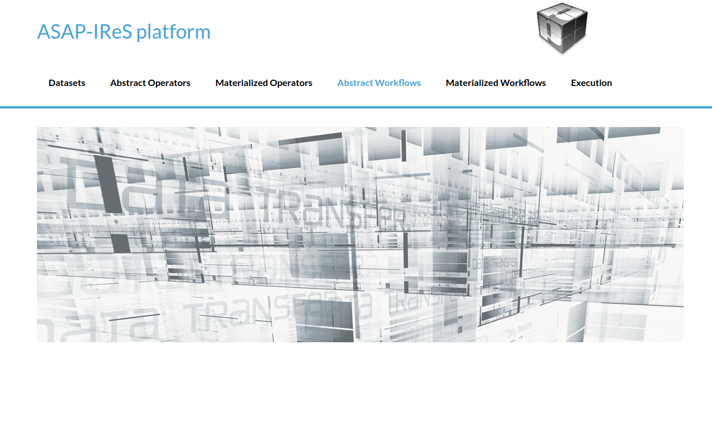
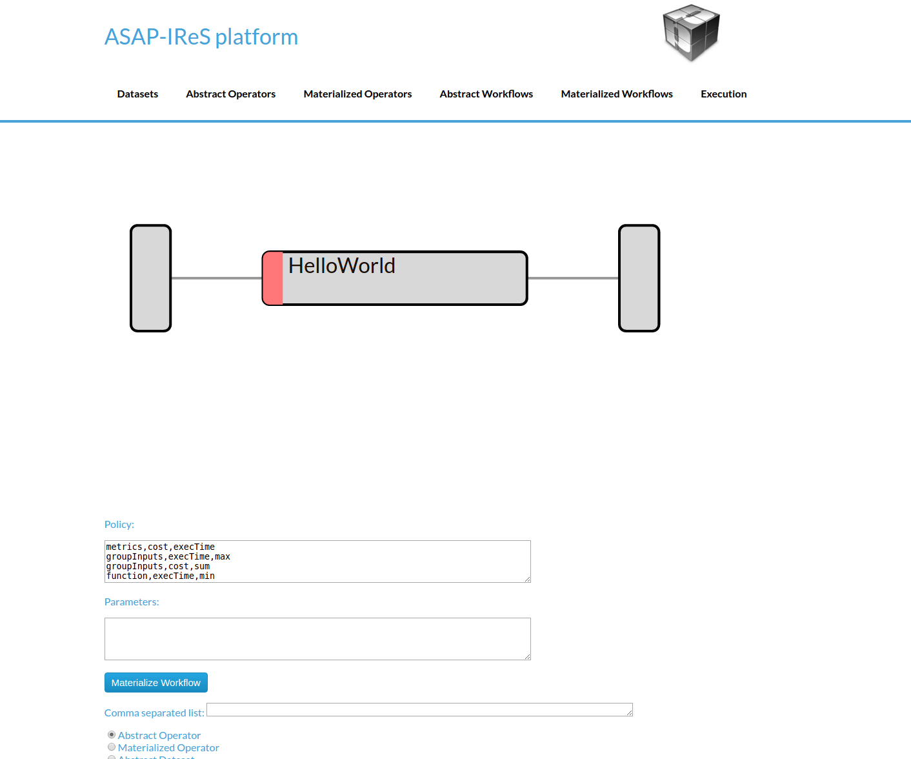
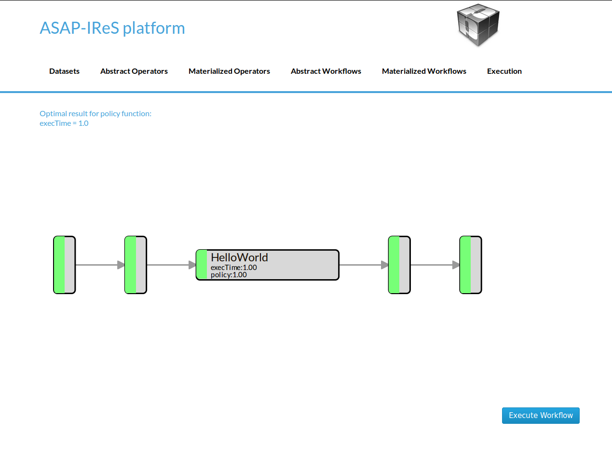
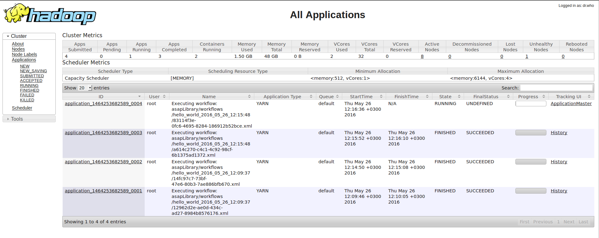
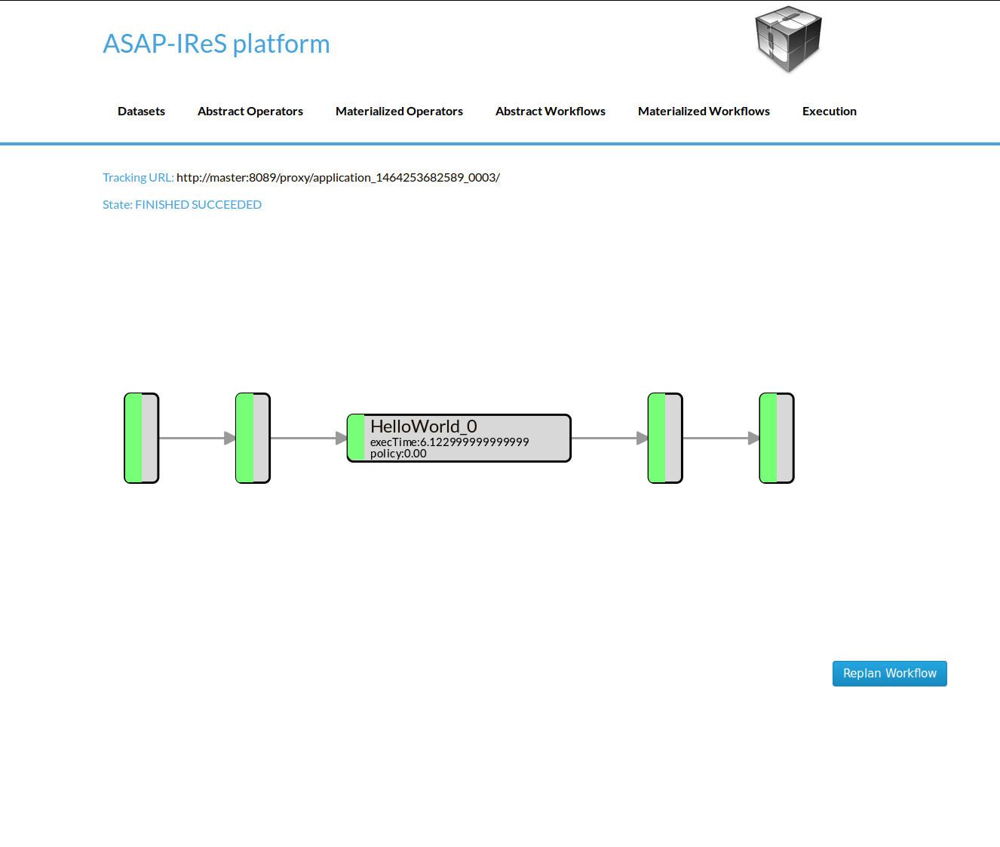
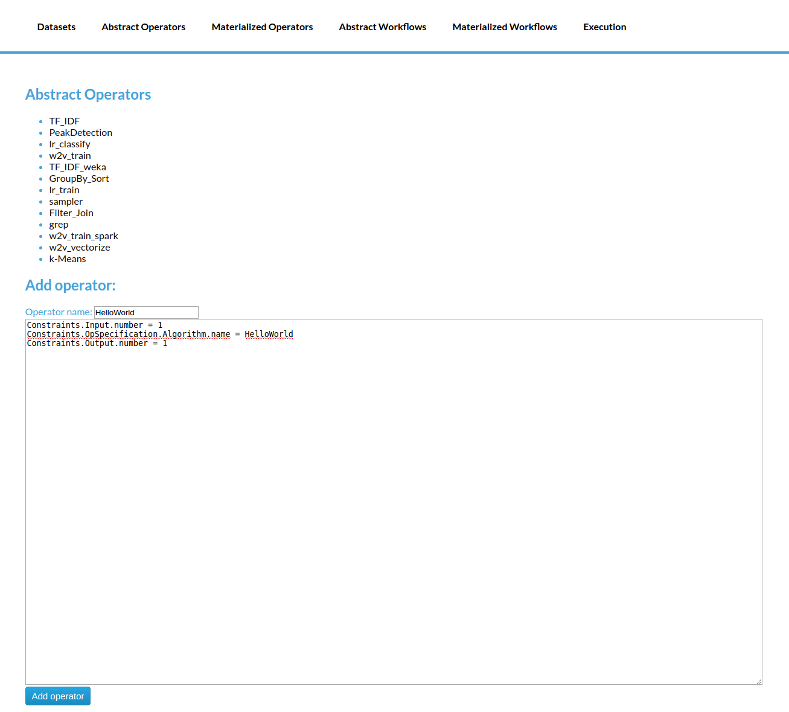
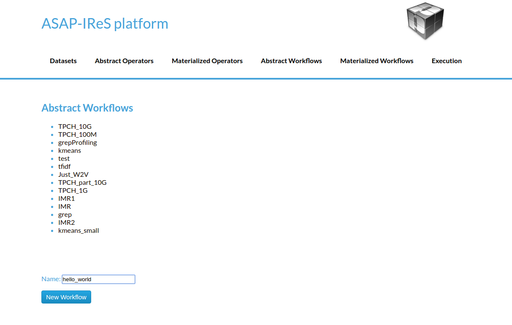
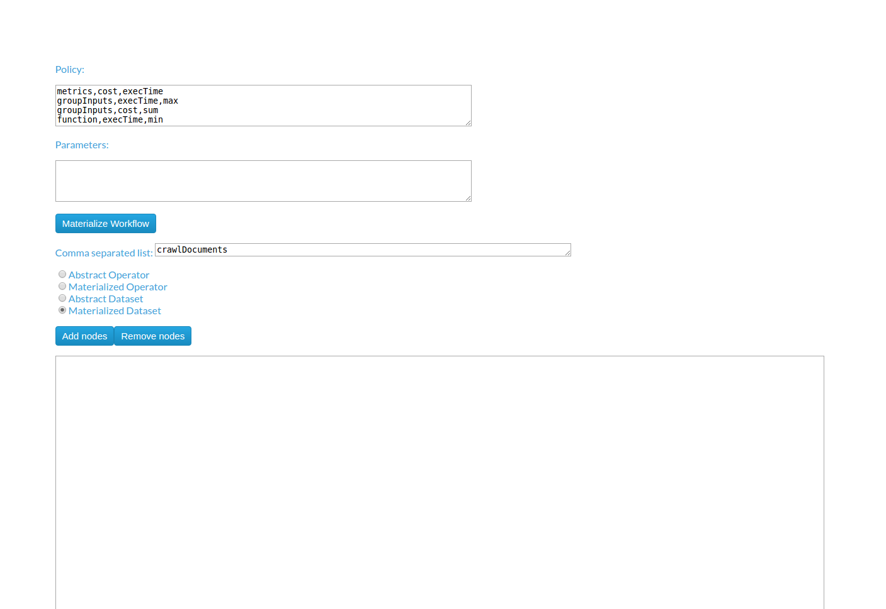
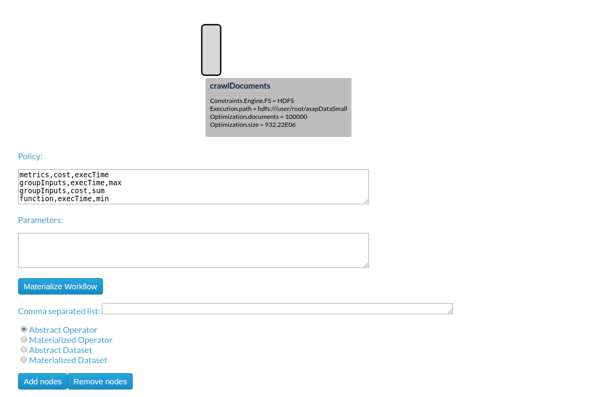
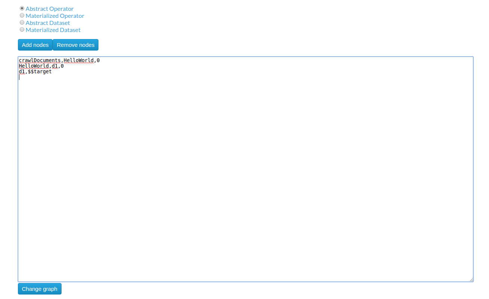

#########################
Installation & Deployment
#########################

========================
Installing IReS-Platform
========================

------------
Prerequisite
------------

To build the project, version 3 of maven is required because the previous version has bugs 
with jetty and jersey packages. In Ubuntu just execute

.. code-block:: bash

   sudo apt-get install maven

and confirm the maven version by running

.. code-block:: bash

  mvn -v

For other systems, you can find relevant instructions on the Web.

--------
Overview
--------

Installation of IRes-Platform requires the following steps:

  1. Clone the IReS-Platform code from the GitHub repository at https://github.com/project-asap/IReS-Platform. 
     You need to install ``git`` first (`find here a quick reference of how to use git,  <https://rogerdudler.github.io/git-guide/>`_

  2. Build IReS-Platform project using maven.
  
  3. Update some configuration files and folders appropriately.

-----
Build
-----

A Linux operating system like Ubuntu it is assumed in this step. In Windows or other Linux distributions the equivalents should be done.

In the following, ``IRES_HOME`` refers to the directory where the IReS code has been cloned, e.g., it can
typically be ``/home/$USER/asap/IReS-Platform``. Please define this  variable in your ``bash`` environment.

.. code-block:: bash

     export IRES_HOME = <path-to-ires>
     
Some POM files has to be updated to refer to the currently installed YARN version. Navigate to $IRES_HOME folder and then

  -  edit the  ``$IRES_HOME/asap-platform/pom.xml`` file. Find the line about ``hadoop.version`` 
     and report the version number of the currently installed YARN version/ For instance,
     if the Hadoop version is  2.7.3, the POM file should contain.
     
     .. code-block:: xml
     
          <hadoop.version>2.7.3</hadoop.version>
 
  - edit the  ``$IRES_HOME/cloudera-kitten/pom.xml`` file and do the same change.
   
Then, navigate to the folder ``$IRES_HOME/panic`` and build this sub-project by runninng

.. code-block:: bash

     sudo mvn clean install -DskipTests

Do the same for the ``$IRES_HOME/cloudera-kitten`` folder and 
ignore the message "BUILD FAILURE" for the moment if that message occurs. 

.. code-block:: bash

     cd ../cloudera-kitten ;  sudo mvn clean install -DskipTests
     
Next, build similarly the ``$IRES_HOME/asap-platform`` folder and ingore again a 
possible "BUILD FAILURE" message. 

.. code-block:: bash

     cd ../asap-platform ;  sudo mvn clean install -DskipTests

Repeat the process for the last two folders with the same order,
i.e. first build ``$IRES_HOME/cloudera-kitten`` and afterwards build ``$IRES_HOME/asap-platform``.
At the end, you should see a "BUILD SUCCESS" message. The building order of the directories above should be followed.

Apart from the "BUILD SUCCESS" message, you should also see a newly created 
folder by the name ``target`` for each of the directories above i.e. 
``panic``, ``cloudera-kitten``, and ``asap-platform`` if it did not already exist.

------
Update
------

To run asap-server successfully and correctly, two things must be done. The first thing is to define the home folder of the ASAP server. The second one is to copy the cluster configuration files to the corresponding folder of the ASAP server.

As for the ASAP server's home folder, the corresponding file

$IRES_HOME/asap-platform/asap-server/src/main/scripts/asap-server

should be updated. In this file the variable "ASAP_SERVER_HOME" should be assigned the path of the folder "asap-platform/asap-server/target" and thus under the line

#IRES_HOME=/path/to/IReS-Platform_project

set the IRES_HOME=

to your custom IRES_HOME e.g.

IRES_HOME=/home/$USER/asap/IReS-Platform

Notice that the folder "$IRES_HOME/asap-platform/asap-server/target" has been created during the building phase.

--> As for the cluster configuration files, it is assumed that a YARN( or Hadoop 2.0) cluster is already set up and that YARN can be found for example in

YARN=/home/$USER/yarn

Copy the $YARN/etc/hadoop/core-site.xml and $YARN/etc/hadoop/yarn-site.xml files into the $IRES_HOME/asap-platform/asap-server/target/conf directory. Finally, the yarn-site.xml must have a minimum set of properties in order for the IReS-Platform to work correctly. This minimum set of properties can be found in resources/conf/yarn-site-min.xml file of this repository. Similarly for the core-site.xml file there is a core-site-min.xml into the same folder.

===============================
Running the HelloWorld workflow
===============================

The HelloWorld is a simple workflow constists of just a single operator, designed for demonstration purposes. To run the HelloWolrd follow the next steps:

1. Go to IReS UI: http://localhost:1323/web/main

	
	IReS Home Page

2. Go to the **Abstract Workflows** tab and select the **HelloWorld** workflow

.. figure:: abstractworkflows.png
	
	Abstract Workflows Tab

3. Then click on **Materialize Workflow** button

	
	Abstract HelloWorld Workflow

4. Click on the **Execute Workflow** button to start the execution

	
	The materialized HelloWorld workflow

In the figures below we can see the execution process

.. figure:: exec1.png
   :width: 150%

   The execution has been started

   The submitted YARN application

   The execution has been finished

==================================
Create a new workflow from scratch
==================================

In this section we describe the process of design a new workflow from scratch.

------------------------------
1. Creating Abstract Operators
------------------------------

In order to create a new workflow the definition of the abstract operators is needed. To define the **HelloWorld** abstract operator go to the **Abstract Operators** tab and enter the operator description in the text box. To create and save the new abstract operator click the "Add operator" button.

----------------------------------
2. Creating Materialized Operators
----------------------------------

Currently, to add a materialized operator a folder with the least required files is needed. 

i. From the bash shell, go to the **asapLibrary/operators** folder in the IReS installation directory.

.. code:: bash

	cd $ASAP_HOME/target/asapLibrary/operators

ii. Then, create a new folder named with the new materialized operator's name. 

.. code:: bash

	mkdir HelloWorld

iii. Create the **description** file and enter the information below

.. code:: bash

	$ nano description

.. code:: javascript

	Constraints.Engine=Spark
	Constraints.Output.number=1
	Constraints.Input.number=1
	Constraints.OpSpecification.Algorithm.name=HelloWorld
	Optimization.model.execTime=gr.ntua.ece.cslab.panic.core.models.UserFunction
	Optimization.model.cost=gr.ntua.ece.cslab.panic.core.models.UserFunction
	Optimization.outputSpace.execTime=Double
	Optimization.outputSpace.cost=Double
	Optimization.cost=1.0
	Optimization.execTime=1.0
	Execution.Arguments.number=1
	Execution.Argument0=testout
	Execution.Output0.name=$HDFS_OP_DIR/testout
	Execution.copyFromLocal=testout

iv. Create the .lua file with the execution instructions

.. code:: bash
	$ nano HelloWorld.lua

.. code:: javascript

	operator = yarn {
	  name = "Execute Hello world",
	  timeout = 10000,
	  memory = 1024,
	  cores = 1,
	  container = {
	    instances = 1,
	    --env = base_env,
	    resources = {
	    ["HelloWorld.sh"] = {
	       file = "asapLibrary/operators/HelloWorld/HelloWorld.sh",
	                type = "file",               -- other value: 'archive'
	                visibility = "application"  -- other values: 'private', 'public'
	        }
	    },
	    command = {
	        base = "./HelloWorld.sh"
	    }
	  }
	}

v. Create the executable

.. code:: bash

	$ nano HelloWorld.sh

.. code:: javascript

	#!/bin/bash
	echo "Hello world" >> $1

vi. Restart the IReS server

.. code:: bash
	
	$ $IRES_HOME/asap-server/src/main/scripts/asap-server restart

---------------------------------
3. Creating the Abstract Workflow
---------------------------------

Now we will combine everything we created in the above steps to generate the new workflow. Go to the **Abstract Workflows** tab and click the "New Workflow" button.

Then we add the workflow parts one-by-one. First we add the **crawlDocuments** dataset from the dataset library. Select the **Materialized Dataset** radio button and enter the dataset name in the **Comma seperated list** text box. Then click the **Add nodes** button to add the dataset node to the workflow graph. Repeat this step to add an output node with name **d1**. Just enter the name **d1** to the text box and click the **Add nodes** button.

Add the **HelloWorld** abstract operator to the workflow. Select the **Abstract Operator** radio button, enter the operator's name (HelloWold) in the text box and click again the **Add nodes** button.

.. image:: newworkflow4.png
   :width: 150%

Describe the workflow by connecting the graph nodes defined in the previous steps as shown in the figure bellow and click the **Change graph** button.

In the figure bellow we can see the generated **Abstract Workflow**. Now click the **Materialize workflow**

.. image:: newworkflow6.png
   :width: 150%

The resulting materialized workflow

