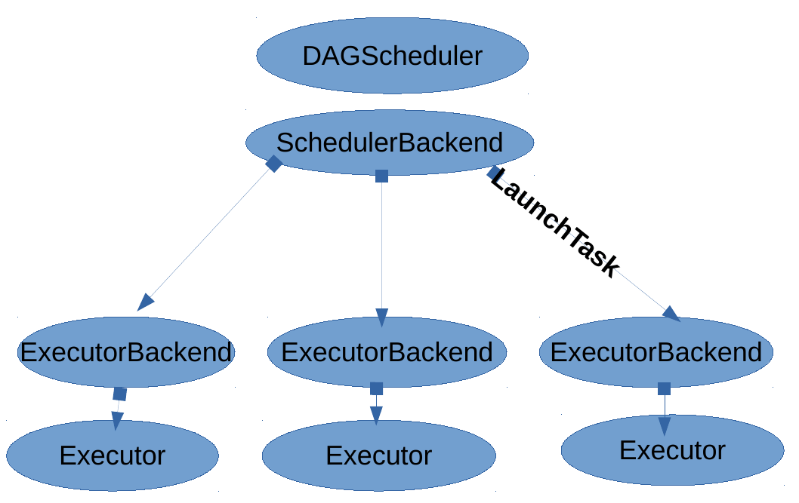

.. highlight:: rst

**************************************
Extension of Apache Spark
**************************************

Introduction
############

Spark is a fast and general cluster computing system for Big Data. It provides high-level APIs in Scala, Java, Python, and R, and an optimized engine that supports general computation graphs for data analysis. It also supports a rich set of higher-level tools including Spark SQL for SQL and DataFrames, MLib for machine learning, GraphX for graph processing, and Spark Streaming for stream processing. We designed and implemented an execution engine for recursive analytics queries. The execution engine design is an extension of the Spark analytics engine.  We extended the Spark scheduling algorithm to allow for ongoing analytics queries to issue sub-queries recursively, by modifying the scheduling actors of Spark to forward query initializiation and completion messages to the scheduler node.  We avoid centralizing  the  scheduling  algorithm  by  optimizing  for  direct  communication  between  worker nodes whenever possible, to avoid congesion at the scheduler node.  Moreover, we added supporting primitives for the recursive, hierarchical decomposition of data using parallel (not iterative) analytics queries, and present the design and early implementation of a distributed scheduler implementation that can parallelize scheduling overheads to allow for finer-grain computations or scale to larger numbers of worker nodes. Spark does not support nested RDD operations because the RDD metadata required to schedule new computations that are stored only at the master node, executors runs tasks that assigned to them. All of the scheduling and execution in Spark is done based on these data, allowing each RDD to implement its own way of computing itself. Having nested RDD operatos inside the user-defined functions requires the executor nodes that run the tasks of the outer RDD map operator to behave as the master node and schedule the ``nested'' filter job created in the mapper function. Adding such functionality the RDD data would need to be replicated on executors, which would require maintaining RDD metadata consistent among all distributed copies of an RDD. We also extended the Spark scheduler to receive messages from the executors. 

Dependence Analysis
###################

The  fundamental  abstraction  in  Spark  are  RDDs  (Resilient  Distributed  Dataset)  which  are  immutable partitioned collections, stored in an external storage system, such as a file in HDFS, or derived by applying operators to other RDDs. RDDs support two types of operations:  transformations which create a new dataset from an existing one, and actions which return a value to the driver program after running a computation on the dataset. All transformations are lazy, therefore each RDD keeps track of all the transformations applied to the base dataset and they are only materialized when an action requires a result to be returned to the driver program. Once an action on a RDD is triggered on the driver side, a job is submitted to the scheduler. Each job is decomposed in smaller sets of tasks called stages that depend on each other (similar to the map and reduce stages in MapReduce). The decomposition into stages is achieved by classifying RDD dependencies into narrow and wide.  In case of a narrow dependency, each partition of the child RDD is derived by at most one partition of the parent RDD. In case of a wide dependency, each partition of the child RDD is derived by several parent partitions.  Hence, each stage contains as many pipelined transformations with narrow dependencies as possible. The boundaries of the stages are the shuffle operations required for wide dependencies (or any already computed partitions). Moreover, the RDD abstraction also enables the data analyst to provide hints how the data should be partitioned and calculated by providing:
• **Partitioners** that define how the elements in a key-value pair RDD are partitioned by key and
• a list of **preferred locations** to compute each partition on (e.g.  block locations for an HDFS file)

Scheduler
#########

The Spark scheduler first examines the RDDs lineage graph to build a DAG of stages. Then, it will try to submit the final stage.  However, if the parent stages are not yet available it will recursively force them to be calculated.  Whenever a stage’s parents are available, the scheduler will launch the necessary tasks in order to compute the missing partitions. The task scheduler running in the driver side decides which tasks should run in which node based on resource and locality constraints.  For instance, if a task needs to process a partition that is available in memory on a node, it will be sent to that node.  Otherwise, if a task processes a partition for which the containing RDD provides preferred locations,  it will be send it to those locations. Finally, the SchedulerBackend module, which resides also in the driver program, generates a message containing the serialized task for each task and sends it to the scheduled executor.

Execution Engine
################

The executor once receives the task, deserializes it and runs it. Tasks are divided into ResultTasks and ShuffleMapTasks. The final stage consists of various ResultTasks while the intermediate stages consists of ShuffleMapTasks.  The output of ResultTasks is sent back to the driver while the output data of the ShuffleMapTasks are written to the local file system waiting for subsequent tasks (reducers) to download them. Whenever a task requires intermediate data from parent stages will make remote pull requests to download them. Finally, upon the end of the execution, the executor notifies the driver program about the task execution result status.

Scheduling Mechanism
####################

The overview of the scheduling mechanism are shown above. Τhe main cluster messages for Spark scheduler-executor communication are:
1.  RegisterExecutor :  When an executor is initiated, it sends a message to master to register itself.
2.  LaunchTask : Master sends a serialized task.
3.  StatusUpdate : The executor updates master with the task state(RUNNING,FAILED,FINISHED).
4.  KillTask : Master orders an executor to stop executing a task.

Moreover, we introduce some extra control messages to the Scheduler-Executor protocol. The sequence of messages that are sent between them are shown in the following figure.

Link
####

The code of the NestedSpark can be found in https://github.com/project-asap/spark01.git

Install
#######

For demostration reasons a Linux operating system like Ubuntu it is assumed in this step. In Windows or other Linux distributions the equivalents should be done.

The build instructions are the following:

1. Install sbt: 
        	sudo apt-key adv --keyserver hkp://keyserver.ubuntu.com:80 --recv 642AC823
		sudo apt-get update
		sudo apt-get install sbt

2. Check the version of the installed Hadoop-yarn

3. Build the spark: cd <Spark_home>
	            ./build/sbt -Dhadoop.version=<Hadoop_version> -Pyarn -DskipTests clean assembly		    

4. Configure spark: cd <Spark_home>
		    cp conf/spark-env.sh.template conf/spark-env.sh
		    Set the IP of master node in the file conf/spark-env.sh
                    cp conf/spark-defaults.conf.template conf/spark-defaults.conf
                    For every slaves node execute: cp conf/slaves.template conf/slaves and insert the list of all executor's IPs

5. Start spark: ./sbin/stop-all.sh

Tests
#####

Clone the code of spark tests: git clone https://github.com/project-asap/spark-tests.git

1. Build In the <Spark_tests_home> execute: mkdir -p /lib
				   cp <Spark_home>/assembly/target/scala-2.10/spark-assembly-*.jar lib/
			           sbt clean package

2. Test the hierarchical, in the <Spark_tests_home>: <Spark_home>/bin/spark-submit --class HierarchicalKMeansPar target/scala-2.10/spark-tests_2.10-1.0.jar spark://<Spark_master-ip>:7077 100 2 2 2 <text_file_path> --dist-sched false

3. Test the distributed scheduler, in the <Spark_tests_home>: <Spark_home>/bin/spark-submit --class Run target/scala-2.10/spark-tests_2.10-1.0.jar --master spark://<Spark_master_ip>:7077 --algo Filter33 --dist-sched true --nsched 4 --partitions 32 --runs 15

			 
							    
		    
	            

