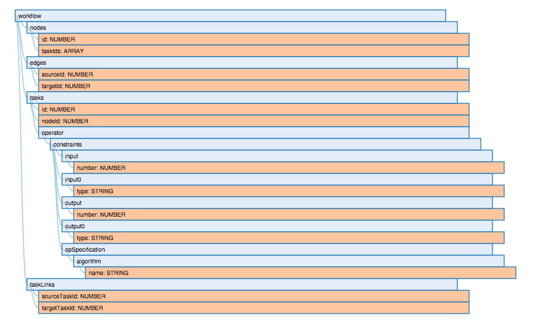
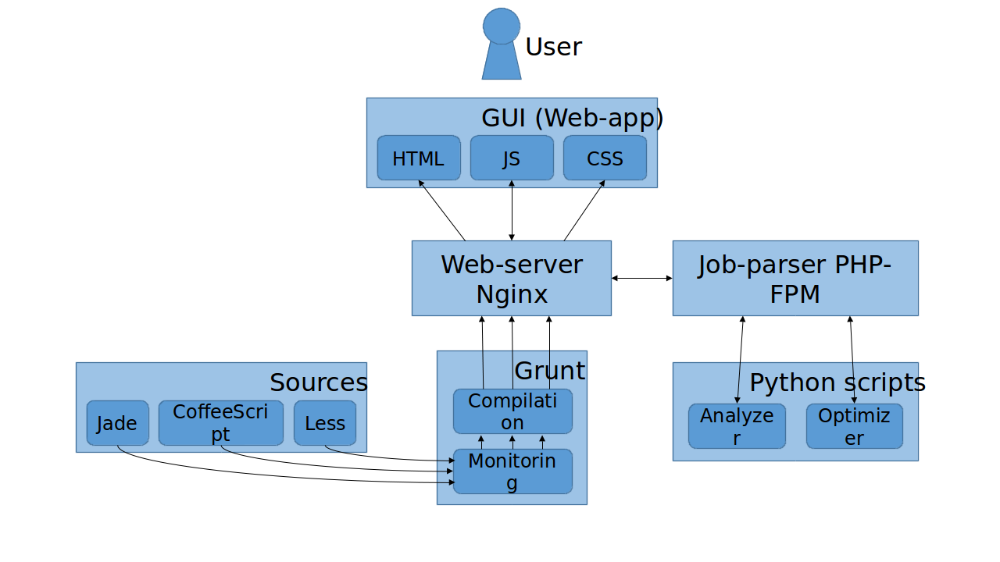
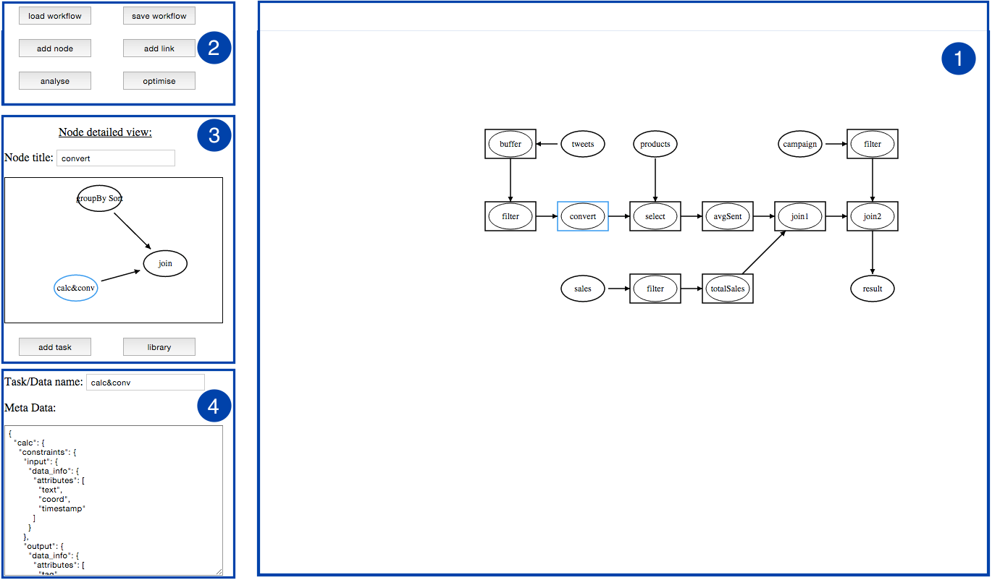

.. highlight:: rst

**************************************
Workflow Management Tool Documentation
**************************************

Introduction
############

The Workflow Management Tool (WMT) is a component of the ASAP system architecture. It is used for workflow creation, modification, analysis and optimisation. WMT provides a GUI for workflow design. The model underlying WMT combines simplicity of expression of application logic and adaptation of the level of description of execution semantics. It enables the separation of task dependencies from task functionality. In this way, WMT can be easily, i.e. intuitively and in a straightforward manner, used by many types of users, with various levels of data management expertise and interest in the implementation. The workflow and the including tasks are described using a JSON-based metadata language. The workflow is analysed and the result of the analysis can be a list of detected errors of a workflow or an analysed workflow which is actually an enhancement of the initial workflow with more vertices, substitution of vertices and/or edges in the initial workflow with others, and addition of metadata to the tasks. WMT is a fully open-source instrument that includes the designing interface, as well as analysis and optimisation modules.

Workflow Representation
#######################

In WMT, a workflow is represented in a single JSON file. This representation captures structural information, design metadata (e.g., functional and non-functional requirements, physical characteristics like resource allocation), operator properties (e.g., type, schemata, statistics, engine and implementation details, physical characteristics like memory budget), and so on.
The first levels of the metadata tree of the workflow are the following (shown in the Figure below): 

• **Nodes** Each node contains a list of task IDs which belong to this node.
• **Edges** This is a list of pairs of node IDs - (sourceId, targetId). An edge defines the flow of data from one vertex to another. These nodes are called the source and the target, respectively.
• **Tasks** This part contains a list of task meta-data. The task meta-data consists of the information that is used to match abstract and materialized operators and datasets and the ID of a node to which this task belongs.
• **TaskLinks** (optional) This part contains links between tasks lying within a single node.

Workflow Analysis
#################

The workflow structure alleviates from the user the burden of determining any or some execution semantics for the application logic. The execution semantics of the workflow includes the execution of tasks in vertices and the execution of input-output dependencies of edges. The determination of the execution semantics of vertices and edges leads to an execution plan of the workflow. We refer to this plan as the analysed workflow. The latter is actually an enhancement of the initial workflow with more vertices, and substitution of vertices and/or edges in the initial workflow with others. More specifically, in the analysed workflow, an edge with different input and output metadata, may be replaced with two edges and a new vertex; the new vertex corresponds to a new task that takes the data and metadata of the input of the initial edge and produces the data and metadata of the output of the initial edge. In other words, since the data of the input and the output of an edge are equivalent, this task changes only the metadata. Such vertices are associative, as they encompass associative tasks. Also, a vertex that includes multiple tasks, in the original workflow, is replaced, in the analysed workflow, with a set of new vertices that each includes one task of the original vertex. The new vertices may or may not be connected with new edges. Furthermore, in the analysed workflow, a vertex that corresponds to multiple tasks is replaced with an associative subgraph that contains a set of new vertices that correspond to these tasks. This set contains vertices that correspond to the tasks of the initial vertex: each new vertex corresponds to one task; vertices may correspond 1-1 to tasks, but it can be the case that two or more vertices correspond to the same task. Naturally, the incoming edges of the initial vertex may have to be replicated, since they may correspond to the input of more than one tasks. The outgoing edges, however, remain the same, as each corresponds to the output of one task. The replacing subgraph may also contain new edges that connect the replacing vertices. Such edges represent the dependencies between tasks related to their execution semantics, and not related to the semantics of the application logic, as expressed by the user.

Workflow Implementation
#######################

.. image:: figures/architect.png

The above figure depicts the architecture of WMT as well as its interaction with external components. The main components of the architecture are:

• **Interface** The interface accepts a workflow definition in the workflow representation. It enables users to interactively create and/or modify a workflow.
• **Analyzer** The analyzer parses the workflow, identifies operators and data stores and maps them to a library of operators supported in WMT, generates metadata of edges, finds edges where the data conversion should be applied and adds the appropriate conversions.
• **Optimizer** The optimizer generates a functionally equivalent workflow graph optimized towards the performance objective.

These provide for workflow design, analysis and optimization. After their design, analysis and optimization, workflows are ready for their execution. They can be executed on independent engines and storage repositories, i.e. engines and repositories that may be accessed through other paths in ASAP or another third party platform, besides WMT.

Workflow Architecture
#####################

WMT interface is a web application. It provides full functionality for designing a workflow even in the absence of server-side (Analyzer and Optimizer modules). It is encoded in Hypertext Markup Language (HTML) . To deliver content, WMT uses the Nginx web server. To encode business logic, WMT uses Javascript and PHP-FPM. The pages and scripts are compiled using Grunt. The Analysis and Optimisation modules are scripts in Python. The figure below depicts the technical stack used in WMT and the interaction of WMT parts.

Workflow Functionality
######################

WMT provides a GUI to enable users to design workflows and perform analysis and optimization. The GUI consists of several areas (Figure 4.1) that perform the following functions:
• Display the workflow (Area 1).
• Add nodes and edges (Area 2). This process depicted in the figure above. First, the user adds a node, then she adds two tasks in it from the operators library, and finally she connects nodes and tasks.
• Create a new workflow from scratch, save and load it.
• Perform workflow analysis or optimization.
• Add tasks from a library (see the figure below) or create new ones (Area 3). If the user adds a task from a library then it is accompanied by a set of metadata, i.e., properties that describe them. If a new task is created then the first levels of the metadata tree are predefined but users can add their ad-hoc subtrees to define their custom data or operators.
• Display metadata of the selected task (Area 4).

.. image:: figures/lib_buttons.png

Link
####

The code of the WMT can be found in <https://github.com/project-asap/workflow.git>

Install
########

For demostration reasons a Linux operating system like Ubuntu it is assumed in this step. In Windows or other Linux distributions the equivalents should be done.

The installation instructions are the following:

a. Install nginx, php-fpm, npm and python packages. Execute the command: sudo apt-get install nginx php-fpm npm python

b. The project's root directory stores a configuration file for nginx: wmt.conf.default. It should be changed appropriately: on line 5 set $ROOT "/your/path/to/wmt";. Then you can use this file for nginx server configuration: ln -s ~/your/path/to/wmt/wmt.conf /your/nginx/installation/servers/ (where nginx server is installed.)

c. Install the Grunt's command line interface (CLI) globally can be done with the following commands: sudo npm install -g grunt-cli

d. Start nginx: sudo service nginx start

Tests
#####

To run tests, do python -m unittest -v testmain in the directory pub/py/ Currently, the following functions have test coverage:

1. *analyse()* - comparison of its result with the presaved result in a file testwl-a.json
2. *save()* - checking that save function generates a file with correct name
3. *execute()* - checking that execute function saves a workflow in IReS format (correct folder and presence of required files in it)
4. *findNode()* - checking that found node with findNode function has correct id
5. *findTask()* - checking that found task with findTask function has correct id
6. *findEdge()* - checking that found edge with findEdge function has correct id
7. *dict2text()* - comparison of its result with the presaved result

Design a workflow
#################

Creating a workflow from scratch can be done by following steps:

1. First, click new workflow on the top of the page.
2. Then, create a graph of a workflow: add nodes and datastores using buttons add datastore and add node; connect them using button add links, when it is pressed сlicking on the first then the second nodes adds an edge between them.
3. Add tasks into the nodes: choose a node; click add task on the left sidebar; choose from the list of operators and then edit metadata to your needs.
4. Save the workflow, click save workflow on the top navbar.

